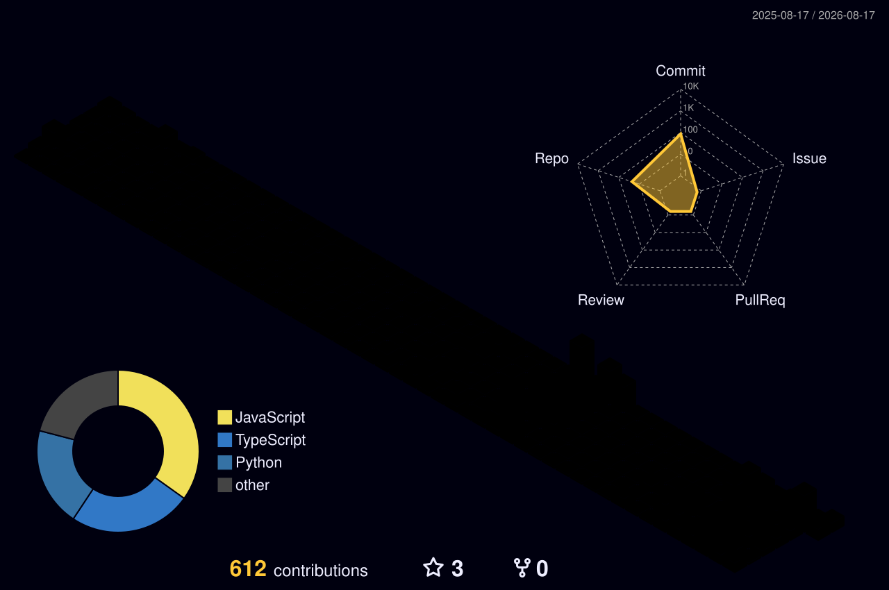

<h1 align="center">Hi 👋, I'm Deep Mhatre</h1>
<h3 align="center">Data Analyst • Full Stack Developer • AI Engineer</h3>

I build <b>data-driven applications, interactive analytics dashboards, and intelligent automation systems</b>.
Currently working as a Full Stack Developer & Automation Developer at <b>AI Marketing Partners (Australia)</b>.

---

# 🚀 About Me

🎓 **B.E. in Computer Science (AI & ML)** — University of Mumbai (2026)  
💼 **Currently Working** at AI Marketing Partners (Remote, Australia)  
📍 Based in **Navi Mumbai, India**

💡 My focus areas:

- Data Analytics & Business Intelligence  
- SQL & Database Engineering  
- Power BI Dashboards & Data Visualization  
- Full Stack Web Development  
- AI & Workflow Automation  

⚡ I enjoy building **end-to-end data solutions** from **data extraction → analysis → interactive dashboards → production applications**.

---

# 🛠 Technologies & Skills

### Programming

### Data Analytics & Visualization

- **Power BI** — Interactive Dashboards, KPI Cards, Slicers, Drill-through Reports  
- **Excel** — Pivot Tables, Power Query, XLOOKUP, Charts  
- **Python** — Pandas, NumPy, Matplotlib, Scikit-Learn  
- **SQL** — JOINs, CTEs, Window Functions, Aggregations  

---

### Full Stack Development

---

### Databases & Data

- PostgreSQL, MySQL, MongoDB  
- Drizzle ORM, Prisma ORM, SQLAlchemy  
- Data Warehousing, Flat File Processing (CSV, JSON)  
- Row-Level Security (RLS) & Data Governance  

---

### Cloud & DevOps

---

### Tools

---

# 🚀 Featured Projects

---

## 📓 CodeBook — Digital Coding Notebook Platform

**Description**  
A Notion-style coding notebook platform enabling users to write rich notes and execute Python code in real-time within secure Docker sandboxes. Supports 12+ data science libraries.

**Tech Stack**  
`Next.js` `TypeScript` `Supabase` `PostgreSQL` `Docker` `FastAPI` `Drizzle ORM`

**Key Features**

- Real-time Python execution in isolated Docker containers  
- Row-Level Security (RLS) for multi-tenant data governance  
- Monaco Code Editor + Tiptap block editor  
- Full-text search and hierarchical workspace (Notebooks → Topics → Pages)  
- Supports Pandas, NumPy, Matplotlib, Polars, SciPy, OpenCV  

🔗 [Live Demo](https://codebook-silk.vercel.app/) | [Repository](https://github.com/Deep-Mhatre/codebook)

---

## 📊 InvestIQ — Mutual Fund Screening & Analytics Platform

**Description**  
A data-driven financial analytics platform that processes 2,500+ mutual fund schemes to evaluate performance, risk, and return patterns with interactive Power BI dashboards.

**Tech Stack**  
`React` `FastAPI` `PostgreSQL` `Power BI` `SQL` `Python`

**Key Features**

- Quantitative scoring model using CAGR, expense ratio, volatility, and risk metrics  
- Interactive Power BI dashboards for fund comparison and KPI monitoring  
- Custom watchlists and analytics-driven investment decision support  
- Optimized SQL queries for real-time data access  

🔗 [Live Demo](https://invest-iq-ruby.vercel.app/) | [Repository](https://github.com/Deep-Mhatre/InvestIQ)

---

## 📈 HR Analytics Dashboard

**Description**  
An interactive HR analytics dashboard built with Power BI to analyze employee attrition, workforce demographics, and department-wise trends.

**Tech Stack**  
`Power BI` `Excel` `SQL`

**Key Features**

- KPI cards, slicers, and drill-through reports  
- Employee attrition and workforce analytics  
- Automated HR KPI reporting  

🔗 [Repository](https://github.com/Deep-Mhatre/hr_analytics_dasboard)

---

## 🍕 Zomato Insights — SQL Data Analytics

**Description**  
SQL-based analysis on restaurant, customer, and order datasets to identify business trends and generate actionable insights.

**Tech Stack**  
`Python` `SQL` `PostgreSQL` `Streamlit`

**Key Features**

- Advanced SQL using JOINs, CTEs, Window Functions, Aggregations  
- Customer purchasing behavior and restaurant performance analysis  
- Interactive Streamlit dashboard for data exploration  

🔗 [Live Demo](https://deep-mhatre-zomato-insights-app-toynan.streamlit.app/) | [Repository](https://github.com/Deep-Mhatre/zomato-insights)

---

## 🧠 AetherAI — AI SaaS Website Builder

**Description**  
A platform that generates complete website layouts and pages from user prompts using modern AI models.

**Tech Stack**  
`Next.js` `React` `Node.js` `AI APIs` `REST APIs`

**Key Features**

- AI-powered website generation from prompts  
- Dynamic page creation  
- Scalable frontend architecture  

🔗 [Repository](https://github.com/Deep-Mhatre/AetherAI)

---

## 📊 Developer Dashboard

---

## 🏙️ GitCity — Digital Repo Skyline

---

## 🌐 3D Contribution Graph

---

## 🌐 Connect With Me

---

# ⚡ Fun Fact

I enjoy building **data-driven systems that combine analytics, AI, and scalable software architecture** to solve real business problems.

---

⭐ If you like my projects, consider starring the repositories!

